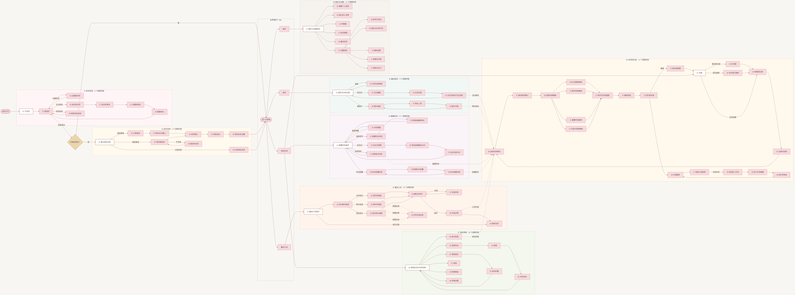

# 《独家童话》用户使用流程

更新时间：2026-09-04  
状态：当前八模块详细版

## 一、整理基准

本流程以 `项目资料/新模块分布/` 的八个模块、114 张正式页面与状态稿、89 个逻辑页面为当前事实基准。流程图从左向右展开，并逐一列出 89 个逻辑页面对应的功能节点；同一页面的加载、成功、失败、空状态等设计稿合并在同一个逻辑节点中，不重复计算。

旧版中的“好友与作品互动”和“3D 日记册”已取消，不进入当前流程。原 3D 日记册相关的长期收藏能力由模块 08「共同回忆册」承接。

## 二、进入应用与建立关系

1. 用户首次进入后查看引导，并选择登录或创建账号。
2. 忘记密码时完成账号验证、设置新密码并返回登录。
3. 登录后检查情侣绑定状态。
4. 未绑定用户通过邀请或邀请码建立关系，确认对象并设置情侣资料。
5. 已绑定用户直接进入主界面。

## 三、四个主 Tab 与八模块

- 首页承载模块 03「童话首页」，用于日记、照片、搜索和共同可见内容。
- 情侣空间承载模块 04「重要时刻」、模块 07「情侣宠物」和模块 08「共同回忆册」。
- 童话工坊承载模块 05「童话工坊」，把共同素材转为漫画或影片。
- 我的承载模块 06「我的与设置」，管理个人资料、双人资料、草稿、标签、会员、隐私和设置。
- 模块 01「账号登录」和模块 02「账号关联」位于进入主界面之前。

四个主 Tab 是导航入口，八个模块是设计与业务归档层级，两者不是同一级结构。

## 四、共同内容的流转

以下内容共同构成模块 08 的素材来源：

- 模块 03 产生的日记和照片；
- 模块 04 沉淀的重要时刻、纪念日与时光胶囊；
- 模块 05 生成的童话漫画和回忆影片；
- 模块 07 形成的宠物成长故事。

用户在共同回忆册中选择这些素材，完成主题与封面、素材确认、页面模板、内容编排和章节页序，随后可以沉浸阅读、使用阅读工具、添加双人补页或管理回忆册。

## 五、流程图

阅读方式：从左向右依次查看进入应用、关系建立、四个主 Tab 与各业务模块；模块内连线表示页面入口和主要操作路径，跨模块虚线表示日记、照片、重要时刻、作品与宠物成长内容汇入「共同回忆册」的素材流转。

可编辑源文件：[用户使用流程.mmd](./用户使用流程.mmd)
